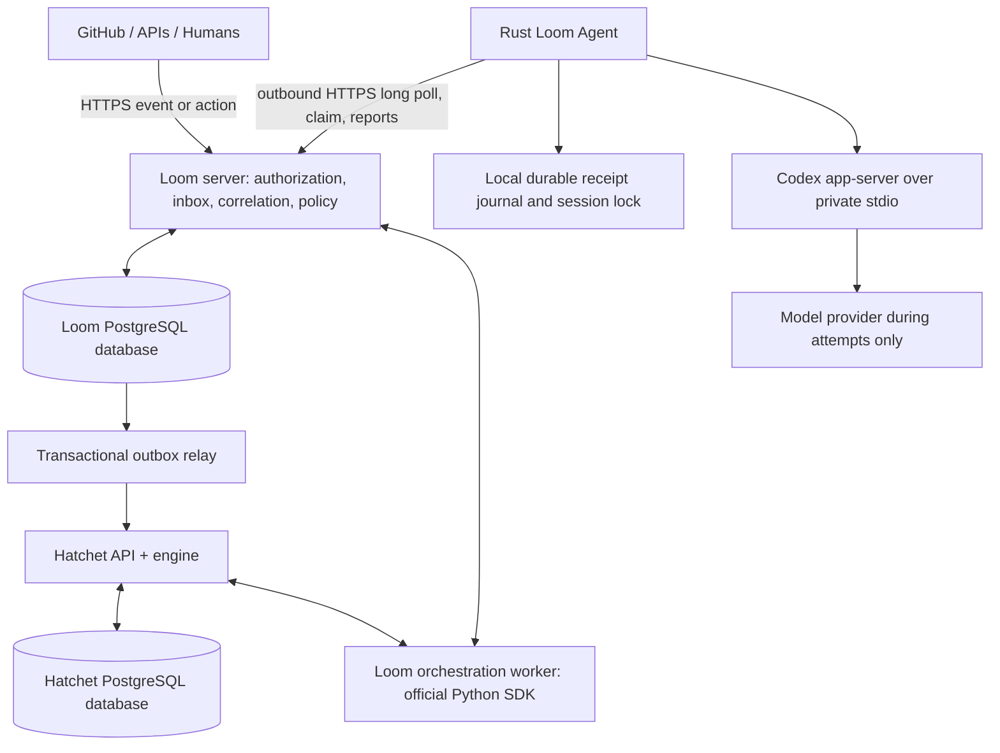

# Architecture

Status: proposed Phase 1 design. See [ADRs](../ADRs/README.md) and [proof gates](implementation-plan.md).

Update 2026-09-09: [ADR-0013](../ADRs/0013-go-backend-migration.md) accepts an
incremental Go migration. `services/loom` serves native read APIs and the compiled
React console; it forwards existing mutations to this Python architecture.
The topology below still describes the active mutation/orchestration path, not
a completed Go migration. See [console operations](console.md).

## Boundary and topology



Use a Python server and central orchestration worker initially because Hatchet documents official Python durable APIs, but no official Rust SDK was found. The Rust agent receives worker-scoped commands over Loom HTTPS. Native Hatchet SDK workers already connect outbound; a custom mailbox is justified by narrow credentials and Rust distribution, not a missing Hatchet networking feature. [Hatchet research](research/hatchet.md)

PostgreSQL may be one service with separate databases/roles for Loom and Hatchet. Never edit Hatchet's internal tables. Loom transactions cannot atomically commit Hatchet state; an outbox bridges that boundary. Hatchet owns workflow continuation, durable timers, task retries and orchestration scheduling. Loom owns authorization, domain state, evidence, identity and attempt admission. No model calls occur inside a replayable orchestration function.

## Minimal implementation layout

```text
crates/loom-core/          domain values and transition validation
crates/loom-protocol/      versioned worker messages
crates/loom-agent/         outbound daemon, local journal, runtime adapter
crates/loom-cli/           thin client, introduced with usable commands
server/                   Python API, store, outbox, Hatchet workflows
integrations/             GitHub normalization; runtime conformance fixtures
workflows/                software policy and examples
migrations/               Loom-owned PostgreSQL schema only
deploy/                   pinned container definitions after Phase 2 proof
tests/                    contract, database, recovery and end-to-end tests
docs/ and ADRs/           current design and recorded decisions
```

Create these components when their phase starts; empty crates and speculative plugin APIs add no proof. Keep the concrete Codex implementation inside loom-agent initially, extracting a separate crate only if it earns an independent boundary. JSON protocol fixtures and conformance tests govern Python/Rust compatibility; Rust types alone cannot guarantee it.

## Attempt admission and runtime launch

1. Authorized Goal creation commits Goal, Run, Session placeholder, audit and start intent.
2. A Hatchet task processes the intent idempotently. It selects an authorized capable worker for an unbound Session, or retains an existing binding.
3. A short transaction creates one Attempt and one command ID. A durable attempt identity is independent of Hatchet task retries.
4. Agent long poll returns only its commands. Claim rechecks owner, Session, generation, policy, cancellation and worker incarnation. Delivery is not permission to execute before claim.
5. The agent journals the claim and obtains an exclusive local Session lock. It creates a provider thread if none exists, journals its ID, reports the binding and waits for server acknowledgment before starting the first model turn.
6. On resume, the exact stored provider thread is required. Start the model turn only after durable admission. Record provider turn ID and observe item/turn notifications.

There is no atomic transaction spanning PostgreSQL, a worker disk, Codex and GitHub. A crash after a launch request but before its acknowledgment is ambiguous. The agent records intent before launch and reconciles provider history/status before repeating it. If evidence cannot establish whether work ran, block for reconciliation; do not promise exactly-once external side effects.

## Yield and event race

```text
agent returns structured outcome
  → agent journals final output and confirms runtime/process tree stopped
  → server commits Attempt outcome + armed Wait + audit + orchestration intent
  → router evaluates already-received evidence AND future events
  → matching evidence commits Wait satisfaction + durable wake outbox
  → Hatchet continuation checks authoritative satisfaction
  → one new Attempt on the bound Session
```

The binding is registered and authorized before the external operation can complete whenever possible. Events are retained in the inbox even while a Run is executing. Arming a wait and routing an event serialize on the same Run lock; arming also inserts a reconciliation intent so an event committed just outside the transaction cannot be missed. Current external state can be fetched deterministically when historical evidence is insufficient.

Hatchet supports scoped event lookback and replay, but those are bounded mechanisms. Loom persists wait satisfaction independently and uses outbox retries plus deterministic recovery checks to re-signal it. A dropped signal never clears satisfaction. A long outage beyond lookback is handled by checking authoritative wait state when a workflow restarts and by scheduled software reconciliation of undelivered continuations. [Hatchet event waits](https://docs.hatchet.run/v1/durable-event-waits)

Do not implement a second general scheduler: recovery scans identify incomplete transfers or missing evidence, then invoke the existing Hatchet workflow. They never reason, code or trigger model attempts merely to check status.

## Crash and partition behavior

| Fault | Recovery rule |
| --- | --- |
| Server dies after domain commit, before Hatchet publish | Replay outbox with the same intent ID |
| Hatchet worker replays workflow | Re-read attempt/command identity; do not launch another model |
| Event arrives before wait registration | Durable inbox plus wait-arm reconciliation |
| Bound worker offline when event arrives | Persist satisfaction; show WAITING/worker; reconnect re-admits the same continuation |
| Worker loses network during a turn | Local lease watchdog interrupts/stops; server records uncertainty until evidence arrives |
| Worker dies after turn finishes, before reporting | Recover its journal and replay same terminal report |
| Worker restarts with a possible surviving child | Reconcile journal and OS process ownership before any new launch |
| Provider history/workspace disappears | BLOCKED/session_unrecoverable; no implicit migration |
| GitHub delivery is missed | Bounded control-plane reconciliation; no model polling |
| Cancellation races with delivery | Claims fail current-state check; active attempt receives interrupt and must report stopped |

Local fencing prevents an old daemon incarnation from reporting as the new one. Server fencing prevents stale reports from mutating current state. Neither alone stops an old process from writing files or calling an external API; exclusive local locks, process supervision and reconciliation are also necessary. Prefer safety over automatic retry when the outcome is unknown.

## Operations

Initial hosting is standard containers under Coolify. Keep Loom HTTPS public, Hatchet administration restricted, and PostgreSQL private. The central orchestration worker can use Hatchet's internal gRPC endpoint on a shared private network. Remote Rust agents need only Loom HTTPS. A developer running the orchestration worker outside that network needs a reachable TLS gRPC endpoint separately from the dashboard URL.

Structured logs include organization/project/Goal/Run/Attempt IDs, transition, command ID, event cause, worker incarnation, retryability and trace ID. Do not log credentials or raw prompts. Store audit history centrally and use trace context compatible with OpenTelemetry. Metrics separate running, suspended, blocked/unknown and needs-human counts.

Back up both databases and Hatchet configuration/secrets; test restoration. Worker state needs independent persistence/backups because central Goal durability cannot recreate lost uncommitted code or provider history. Pin engine image digest, SDK version, Python/Rust dependencies and Codex version before each integration gate. Upgrade using conformance and replay tests; keep active workflow definitions versioned until their Runs drain.
