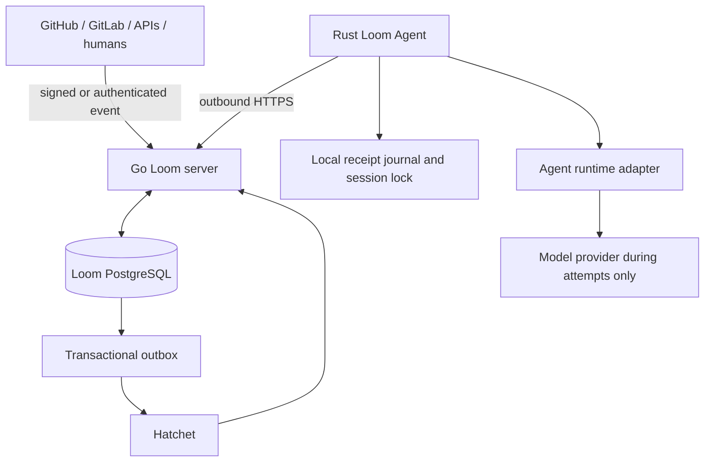

# Architecture

Loom is a Goal-centered control plane. The maintained stack is a Go control
plane, PostgreSQL, Hatchet, a Rust machine Agent, and React/TypeScript clients.
GitHub and Codex are adapters; neither appears in the generic core model.



Hatchet owns durable scheduling, timers, retryable orchestration work and event
wakes. Loom owns Goals, authorization, deterministic correlation, Wait evidence,
Session/Worker affinity, attempt admission, accounting and audit history. A
transactional outbox bridges the Loom database and Hatchet because they cannot
share an atomic transaction. A replayable orchestration task never calls a model
directly.

## Repository boundaries

```text
apps/web/                       React operator console
packages/client/                shared TypeScript API client
services/loom/                  Go control plane and generated Ent persistence
services/loom/internal/control/ generic domain, migrations and admission policy
crates/loom-agent/              Rust outbound daemon and runtime supervision
integrations/                   provider adapters and conformance fixtures
deploy/                         container deployment descriptors
docs/ and ADRs/                 current design and decision history
```

## Execution lifecycle

1. An authorized request creates a Goal, Run and logical Session plus an outbox
   intent in one PostgreSQL transaction.
2. Hatchet delivers orchestration work. Loom selects a permitted capable Worker,
   preserving an existing Session binding.
3. A short transaction creates one Execution Attempt and one command identity.
4. The Rust Agent claims that exact command over outbound HTTPS. Claim admission
   rechecks organization, Worker incarnation, Session, generation and policy.
5. The Agent journals the claim and provider Session ID before starting a model
   turn. A resume must use that exact binding.
6. A finite attempt reports a structured outcome. If it yields, Loom arms a
   versioned Wait only after the runtime is stopped.
7. A verified event satisfies the Wait deterministically and emits one wake
   intent. Hatchet starts a new finite attempt; nothing invokes the runtime while
   the Goal is waiting.

Events are durable inbox records and may arrive early, late, duplicated or out of
order. Arming and satisfying a Wait serialize on the Run. Correlation uses an
organization, integration instance, resource type/ID and expected version; an
LLM never guesses ownership. Provider-specific payload remains outside the core
routing keys.

## Failure rules

| Fault | Recovery |
| --- | --- |
| Server stops after a domain commit | Replay the outbox with the same intent ID |
| Hatchet redelivers work | Re-read the attempt/command identity; never duplicate a launch |
| Event arrives before Wait creation | Retain inbox evidence and reconcile when arming |
| Bound Worker is offline | Keep the Goal active and waiting for that Worker |
| Network is lost during a turn | Stop locally and record an uncertain outcome for reconciliation |
| Provider/workspace state is gone | Block as session-unrecoverable; never move affinity silently |
| Cancellation races with delivery | Reject stale claims and interrupt the admitted attempt |

There is no atomic transaction across PostgreSQL, Hatchet, a Worker filesystem,
an agent runtime and an external provider. Unknown outcomes must be reconciled,
not silently retried. Structured logs and audit entries carry organization,
Goal, Run, Session, Attempt, Worker, event and transition identities without raw
prompts or credentials.

The native HTTP mutation layer and official Hatchet Go worker are connected.
Provider plugin ingress and a live GitHub-to-Codex acceptance still remain.
Until those gates pass, the Go image is a development artifact and must not
replace the currently deployed service.
