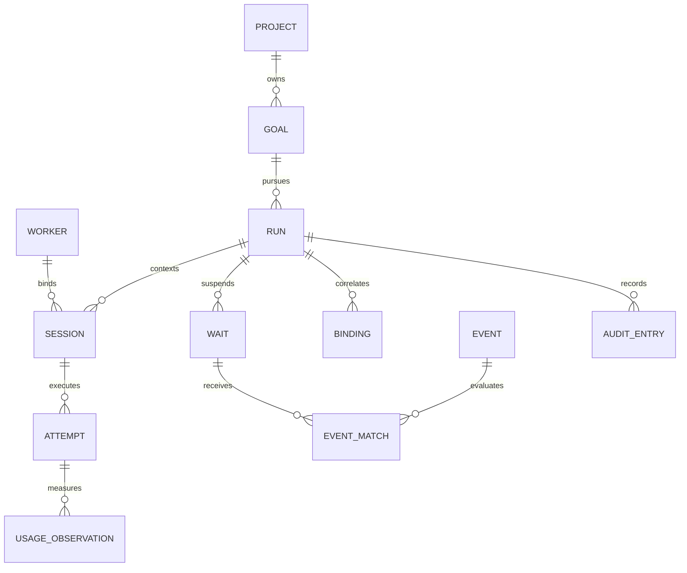

# Data model

Status: proposed logical PostgreSQL schema, not an applied migration. All timestamps are UTC `timestamptz`; IDs are opaque UUIDs unless explicitly external. Use server time for central transition ordering and monotonic local clocks for measured attempt duration.

## Relationships

## Minimum tables

| Table | Required fields beyond ID and timestamps |
| --- | --- |
| `projects` | organization_id, name, owner_principal_id |
| `credentials` | principal_id, organization_id, worker_id nullable, digest, scopes, expiry, revoked_at; opaque tokens never stored in plaintext |
| `goals` | organization_id, project_id, owner_principal_id, title, objective, completion_criteria JSON, current_run_id nullable, state projection, policy JSON, metadata JSON |
| `runs` | organization_id, goal_id, run_number, state, state_version, policy_snapshot, workflow_version, orchestration_reference nullable, failure/reason JSON, started_at, ended_at |
| `workers` | organization_id, owner_principal_id, display_name, labels/capabilities JSON, allowed_runtime_versions JSON, incarnation, last_seen_at, revoked_at |
| `sessions` | organization_id, run_id, role, runtime_type, runtime_version, worker_id nullable until assignment, workspace_ref, provider_thread_id nullable, provider_session_tree_id nullable, state |
| `execution_attempts` | organization_id, run_id, session_id, worker_id, worker_incarnation, attempt_number, command_id, fence, cause_type/id, state, outcome, provider_turn_id nullable, lease_deadline, local_duration_ns nullable, started_at/stopped_at/received_at, failure JSON |
| `commands` | organization_id, attempt_id, worker_id, incarnation, session_id, generation, kind, protocol_version, bounded payload, state, claim_expiry, acknowledged_at |
| `waits` | organization_id, run_id, generation, kind, condition JSON, binding_id nullable, state, deadline nullable, armed_at, satisfied_at nullable, satisfying_event_id nullable |
| `integrations` | organization_id, project_id, source, external_installation_id, allowed_repository_ids JSON, secret_reference, state |
| `events` | organization_id, integration_id, delivery_id, source, type, schema_version, received_at, occurred_at, digest, verification JSON, correlation JSON, bounded payload, processing_state |
| `event_bindings` | organization_id, run_id, session_id, integration_id, resource_type, resource_key, expected_version, generation, authorized_by, authorization_snapshot, active |
| `event_matches` | organization_id, event_id, wait_id, generation, disposition, reason, checked_resource_version, evaluated_at |
| `outbox` | organization_id, intent_key, aggregate_id, kind, payload, available_at, delivered_at, failure/retry metadata |
| `audit_entries` | organization_id, run_id nullable, sequence, actor, action, old/new state, cause_id, bounded metadata, recorded_at |
| `usage_observations` | organization_id, attempt_id, provider, model, source_observation_id, source_kind, counter_kind, token fields nullable, cost_amount/currency nullable, price_version nullable, recorded_at |

A single-organization self-hosted MVP can provision principals through configuration and `credentials`; full users/organizations UI and relational capability tables can wait. Preserve organization scoping from the beginning. Bindings use canonical typed resource keys, not arbitrary text comparisons across inconsistent JSON encodings.

## Constraints and transaction boundaries

PostgreSQL supports uniqueness, foreign keys and partial indexes; row locks can serialize conflicting updates. Use those primitives for the following Loom-specific constraints. [Constraints](https://www.postgresql.org/docs/current/ddl-constraints.html), [row locking](https://www.postgresql.org/docs/current/explicit-locking.html#LOCKING-ROWS)

- Unique `(goal_id, run_number)` and a partial unique index on nonterminal Runs per Goal.
- Unique active Attempt per Session, including `DISPATCHED`, `STARTING`, `RUNNING`, `STOPPING` and `UNKNOWN`. An unknown Attempt cannot free the slot.
- Unique `command_id`, and unique `(run_id, continuation_key)` on attempt admission to deduplicate orchestration replay. Store the continuation key with the attempt.
- Unique `(run_id, generation)` for Waits; MVP has at most one armed Wait per Run. Condition may be a policy-defined aggregate; arbitrary user expression execution is out of scope.
- Unique `(integration_id, delivery_id)` for Events, plus stored digest comparison. Distinct delivery IDs can still be semantically equivalent.
- Unique `(event_id, wait_id, generation)` for evaluations; unique outbox `intent_key` for each satisfied Wait continuation. At most one satisfaction wins under the Run/Wait lock.
- Composite foreign keys including `organization_id` prohibit cross-tenant links. Attempt references must agree with Session's Run and Worker; transaction validation plus composite constraints enforce that relationship.
- Session binding changes require an explicit controlled operation; provider thread identifiers are unique within `(worker_id, runtime_type)` when present. Display names are never keys.
- Check valid enums, nonnegative counters/durations, required stop evidence for confirmed WAITING, and terminal `ended_at`. Cross-row invariants need transactional code or triggers, not a simple CHECK pretending to inspect other rows.

All domain transitions use optimistic `state_version` plus row locking in a fixed order (Run, Session, Attempt, Wait). Commit state, evidence disposition, audit and outbox atomically. Bound transaction retries for deadlock/serialization failures. External API calls happen outside locks; commit only if the snapshot version remains current, otherwise re-evaluate.

## Durability, retention and migration

PostgreSQL notifications are a latency hint to connected listeners, not the durable command queue. Persist commands and scan pending rows after reconnect; losing a notification must not lose work. [NOTIFY](https://www.postgresql.org/docs/current/sql-notify.html)

Never delete unsatisfied Waits, unresolved Attempts, active bindings or pending outbox records due to a short event TTL. Retain normalized evidence sufficient for active policy and keep dedup tombstones through the supported redelivery horizon. Once older receipts expire, current generation/version checks still prevent an old delivery from becoming new authority.

Version event envelopes, command schemas, workflow definitions and policy snapshots. Use additive migrations first; old active Runs retain their policy/workflow version. Destructive changes need a backup, tested restore and explicit migration of active state. An audit trail is for explanation; do not claim complete event-sourced reconstruction unless every required input and transition is actually retained.
