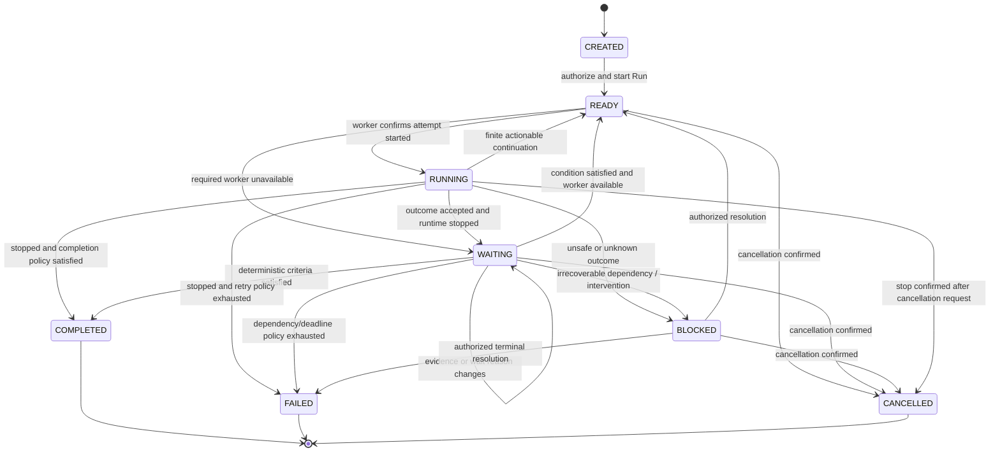

# State machine

Status: proposed. Goal state is a projection of its current Run (or `CREATED` before a Run exists). Transitions, audit entry and their outbox effects commit together. Terminal Run records are immutable; an authorized retry creates a new Run and changes the Goal's current Run pointer.

Any nonterminal state can receive a cancellation intent; the diagram shows its eventual confirmed outcome. An unknown runtime remains `BLOCKED` while cancellation/stop reconciliation proceeds. A READY Run may fail policy admission without starting a runtime; CREATED may be cancelled without a Run.

## Orthogonal execution state

Attempt states: `DISPATCHED → STARTING → RUNNING → STOPPING → STOPPED`. Any uncertain launch or lost observation can enter `UNKNOWN`; recovery resolves it to a known active or stopped state. Outcome is a separate enum: `yielded`, `completed_proposal`, `failed`, `interrupted`, `policy_rejected`.

RUNNING includes start/stop activity only after an attempt has been admitted; READY with a dispatched command does not mean inference has started. If a worker disconnects during execution, mark observation uncertain and Run `BLOCKED` with `runtime_status_unknown`, not a fabricated suspended interval. The worker must enforce a local lease watchdog, but the server cannot infer that it succeeded from silence.

## Transition guards

| Transition | Required guard |
| --- | --- |
| Create Run | Authenticated owner/project authority; policy valid; no other active Run |
| Start Attempt | Current Run, wait generation and authorized worker/session; local single-session lock; no unresolved older attempt |
| Confirm WAITING | Final structured yield validated; runtime stopped and local receipt durable; current fenced report accepted |
| Satisfy Wait | Exact authorized binding/generation; current evidence passes predicate; unique satisfaction transaction |
| Wake | Still nonterminal and authorized; stop known; correct worker; no equivalent continuation exists |
| Complete | All current completion criteria pass; runtime stopped; evidence versions match policy |
| Cancel | Revoke outstanding command claims first; confirm active runtime stopped before terminal status |

Event/timer races use a row lock and generation compare-and-swap. If an event wins, the timer records an obsolete result. If a newer binding supersedes a wait, late events remain audit evidence but cannot satisfy the new wait. Cancellation wins over undispatched work; it cannot undo already completed external side effects.

## Failure taxonomy

Each failure records category, code, retryability, attempt number, cause event and bounded metadata. Categories: `agent`, `runtime`, `worker`, `network`, `integration`, `policy`, `workflow`, `external_operation`, `invalid_event`.

Safe network operations retry with Hatchet backoff and a deadline. Offline workers await reconnection. Ambiguous launches reconcile before retry. Repeated reasoning failures exhaust an explicit attempt budget into `BLOCKED`; no autonomous model-switching policy in MVP. External CI failure is evidence for classification, not automatically a runtime failure.
