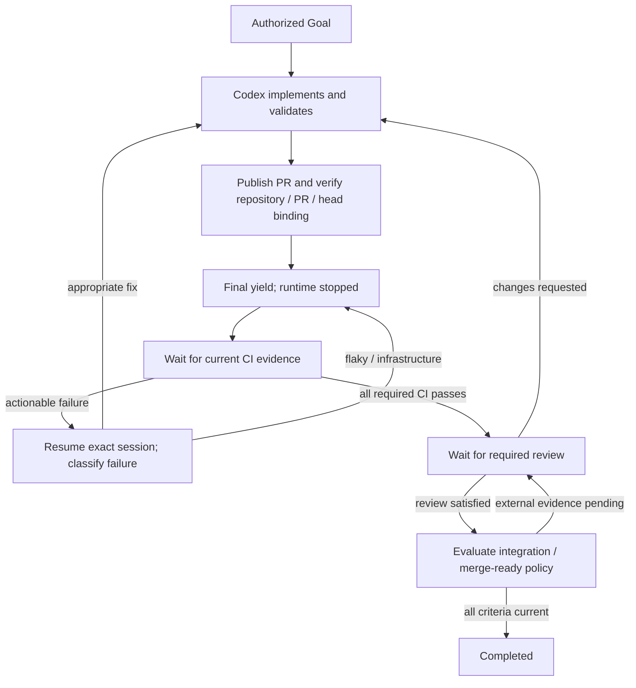

# Workflows

Status: proposed reference behavior. Domain-specific policy is separate from generic Goal state.

## Make a ticket merge-ready

The owner authorizes an objective, workspace/repository, allowed publishing actions, budget and completion criteria. For the first proof, explicitly configure required workflow/check producer identities and review criteria; do not pretend one green workflow establishes all repository rules.

All edges labeled wait have no model execution. The router can move CI success to review waiting using policy alone. Pending integration gets its own typed condition even though the simplified diagram groups external evidence. An event only wakes the agent if it creates reasoning work.

CI-failure input contains bounded failed check context and asks the agent to classify: current change, interaction, pre-existing, flaky or infrastructure. A production edit requires appropriate cause evidence. Retry external infrastructure through explicit policy rather than a hidden model loop. Unknown cause or exhausted budget becomes human attention.

Merge-ready means the current version satisfies the owner's configured criteria. It does not mean automatically merged. Refresh required evidence before completing; a new push invalidates version-scoped CI/review evidence. If the product later tracks repository rulesets, merge queues or integration branches, add tested policy adapters rather than hard-code them into Goal states.

## Generic examples

| Goal | Yield condition | Action after evidence |
| --- | --- | --- |
| Validate deployment | `deployment_id`, `rollout.completed` | Analyze health and propose completion or rollback under policy |
| Produce research | `dataset_id`, `dataset.ready` | Analyze data, then yield for authorized human review |
| Resolve customer case | `case_id`, `customer.reply` | Interpret reply and perform authorized next step |
| Investigate dataset anomalies | `job_id`, `job.completed` | Inspect output and decide whether investigation is needed |

Human approval predicates bind principal authority, action, resource and generation. A stale approval cannot authorize a newer action. Dependencies bind another Goal's identity and the required outcome; failure/cancellation follows policy instead of pretending success. Timers can expire deadlines or trigger software reconciliation without creating a model Attempt.

## Human attention

Expose attention separately from execution: `none`, `needs_human`, `done`. Ordinary waiting/recovery updates belong in the audit view. Notify on an actionable input/approval request, unresolved blocker or terminal outcome, with coalescing and deduplication. No sophisticated autonomous stuck detection in MVP; retain repeated failure signatures, attempt counts and artifact/evidence changes for later analysis.
